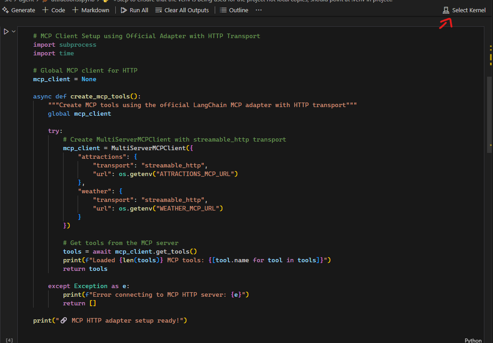

# Attractions Booking Agent

This notebook demonstrates a LangChain agent integrated with MCP (Model Context Protocol) tools for searching and booking tourist attractions. The agent uses Azure OpenAI and can help users discover attractions worldwide and make bookings, whilst checking the weather.

## Prerequisites

- Python - latest
- [uv](https://docs.astral.sh/uv/) package manager
- Jupyter Notebook or JupyterLab
- Azure OpenAI account with deployment of a chat completion model
- Access to the MCP attractions/weather server (running on localhost:8008 & 8009)
- vs code
- jupyter extention - https://marketplace.visualstudio.com/items?itemName=ms-toolsai.jupyter
- node Version > 16 (use nvm if needing to keep node versions)

**Important:** if your not using VS code for whatever reason, some aspects of the of runbook may be difer, so i suggest using VS Code

## Setup Instructions

### 1. Environment Setup

Create a `.env` file in this directory with your Azure OpenAI credentials and mcp configuration:

```env
AZURE_OPENAI_ENDPOINT=
AZURE_OPENAI_API_KEY=
AZURE_API_VERSION=2024-12-01-preview
DEPLOYMENT_NAME=
ATTRACTIONS_MCP_URL=http://127.0.0.1:8008/mcp/
WEATHER_MCP_URL=http://127.0.0.1:8009/mcp/
MACROS_MCP_URL=http://127.0.0.1:8010/mcp/
NUTRITION_PLAN_MCP_URL=http://127.0.0.1:8011/mcp/
```

You can get these credentials from:

- Azure OpenAI service → Azure AI Foundry Portal
- Your Azure OpenAI resource in the Azure portal
- Overview tab for endpoint, API key (selecting "Azure AI Services" tab within "Libraries")

### 2. Register Jupyter Kernel (Important!)

Make sure you have downloaded the offical [Jupyter VS Code extension](https://marketplace.visualstudio.com/items?itemName=ms-toolsai.jupyter).

**Important:** After opening the notebook file (\*.ipynb), make sure to select the correct kernel:

1. Install the offcial jupyter extension
1. After opening the notebook file, click on "Select Kernel" and then "Python Environments...":
   
1. Select "Create Python Environment"
1. Select "venv` → Choose lastest python"
1. Select the one `src\agent\requirements.txt` dependencies to install. Select ok on the prompt.
1. This ensures you're using the local virtual environment, not a global one

This will create a virtual environment and start installing dependencies.

### 3. Start the MCP Server

Before running the notebook, ensure the attractions MCP server / weather mcp is running:

```bash
# From the project root, navigate to the MCP server directory
cd ../../mcp/attractions-mcp

# Start the MCP server on HTTP
uv run main.py
```

The server should start on `http://localhost:8008/mcp/` for attractions

```bash
# From the project root, navigate to the MCP server directory
cd ../../mcp/weather-mcp

# Start the MCP server on HTTP
uv run main.py
```

The server should start on `http://localhost:8009/mcp/` for weather

### 4. Running the Notebook

Open and run the Jupyter notebook:

You can verify the correct environment by running Cell 0 - it should show:

```
python: *CodeDirectory*\Hackathon\Hackathon-2025\.venv\Scripts\python.exe
uv: *Python install location*\Python313\Scripts\uv.EXE
```

After a successful run of entire notebook you should get a little box appear at the top of vs code, you an enter in your questions or type exist to end the run(you will find some example questions at the bottom of the runbook).

## How to Use the Notebook

You can hit `run all` at the top of the notebook, or you can run the cells 1 by 1, you will see the output of each cell underneath the cell once it has been executed.

**Important:** Make sure to re-run all when changing config in env files.

The notebook is structured in sequential cells that should be run in order:

### Step 1: Environment Check

- **Cell 0**: Verifies that the virtual environment is being used correctly

### Step 2: Install Dependencies

- **Cell 1**: Installs uv and all required packages from requirements.txt

### Step 3: Import and Setup

- **Cell 2**: Imports all necessary libraries for LangChain and MCP integration

### Step 4-5: MCP Client Configuration

- **Cell 3-4**: Sets up the MCP client to connect to the HTTP server on localhost:8008

### Step 6: Agent Initialization

- **Cell 5-6**: Creates and initializes the LangChain agent with MCP tools

### Step 7: User Input Handler

- **Cell 7**: Sets up functions to interact with the AI agent

### Step 8: Connection Testing

- **Cell 8**: Tests the MCP server connection and displays available tools

### Step 9: Example Usage

- **Cell 9**: Demonstrates how to use the agent with example queries

### Step 10: Interactive Chat

- **Cell 10**: Interactive chat loop to converse with the agent

### Step 11: Cleanup

- **Cell 11**: Provides cleanup function for proper resource management

## Available MCP Tools

The agent has access to these MCP tools for attractions:

- **search_attractions**: Search for attractions by location and category
- **get_attraction_details**: Get detailed information about specific attractions
- **get_random_attraction**: Get random attraction suggestions
- **book_attraction**: Book visits to attractions
- **search_and_format_attractions**: Search and return formatted results

## Example Queries

Once the notebook is running, you can ask the assistant questions like:

- "What are some popular attractions in Paris?"
- "Find historical sites in Rome"
- "Book the Eiffel Tower for tomorrow for 2 visitors"
- "What's a random famous attraction I should visit?"
- "Show me museums in London"

## FastAPI Server (for Frontend Integration)

If you want to expose the agent over HTTP so the React app can call it, run the FastAPI server that lives in `src/agent/server`.

### 1. Configure environment

Create or update your `.env` (or export variables) with either Azure OpenAI or OpenAI credentials:

```bash
# Azure (preferred)
AZURE_OPENAI_ENDPOINT=
AZURE_OPENAI_API_KEY=
AZURE_API_VERSION=2024-12-01-preview
DEPLOYMENT_NAME=

# Optional fallback
OPENAI_API_KEY=
```

Ensure the MCP servers you need (attractions, weather, macros, nutritional-plan, trivia) are running; the server will use their HTTP endpoints.

Default URLs (override in `.env` if needed):

```
ATTRACTIONS_MCP_URL=http://127.0.0.1:8008/mcp/
WEATHER_MCP_URL=http://127.0.0.1:8009/mcp/
MACROS_MCP_URL=http://127.0.0.1:8010/mcp/
NUTRITION_PLAN_MCP_URL=http://127.0.0.1:8011/mcp/
TRIVIA_MCP_URL=http://127.0.0.1:8012/mcp/
```

### 2. Install dependencies & run server

```bash
cd src/agent
python -m pip install -r requirements.txt
python server/main.py
```

The server listens on `http://localhost:8080` by default and exposes:

- `GET /health`
- `POST /init` → `{ sessionId }`
- `POST /chat` with `{ sessionId?, message }` → `{ sessionId, output }`

Each session keeps in-memory chat history. Restarting the server clears sessions.
Errors from MCP tools are returned to the caller as friendly messages in the API response frame.

### 3. Frontend config

Set the frontend environment variable so it knows where to reach the server:

```
src/frontend/.env
VITE_AGENT_URL=http://localhost:8080
```

Then run the frontend (`npm run dev`) and use the chat UI.

## Troubleshooting

### Common Issues:

1. **MCP Server Connection Failed**

   - Ensure the MCP server is running on localhost:8008
   - Check that no firewall is blocking the connection

2. **Azure OpenAI Authentication Error**
   - Verify your API key and endpoint in the .env file
   - Check that your Azure OpenAI deployment name matches (default: "gpt-5-chat")

### Debug Mode

The agent runs in verbose mode by default, showing the reasoning process. To see detailed logs, check the console output when running cells.

## Project Structure

```
src/agent
├── attractions.ipynb    # Main notebook file
├── requirements.txt     # Python dependencies
└── README.md           # This file
```

## Next Steps

After setting up the notebook:

1. Run through all cells sequentially
2. Try your own travel-related questions
3. Explore different MCP tools and their capabilities
